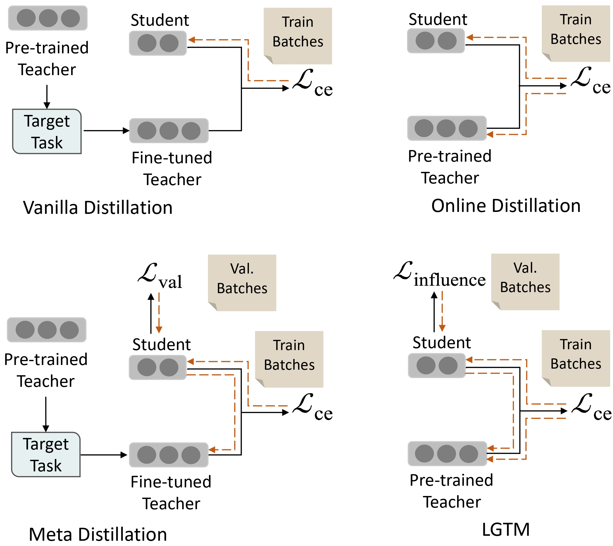

# Tailoring Instructions to Student’s Learning Levels Boosts Knowledge Distillation - LGTM

## Team Members

- Aryaman Rao Nagineni
- Sourabh Swargam

## Introduction

We test the effectivness of the concept of distillation influence to determine the impact of distillation from each training sample on the student's generalization ability.
In this project, we examine **L**earning **G**ood **T**eacher **M**atters (LGTM), an efficient training technique for incorporating distillation influence into the teacher’s learning process.



### Tab of Content

- [Installation](#1)
- [Usage](#2)
  - [Training](#3)
  - [Inference](#4)
  - [Result](#5)
- [Dataset](#6)

<span id="1"></span>

### Installation

1.  Install the dependencies

    ```sh
    conda create -n lgtm python==3.8.0

        conda activate lgtm

        pip install torch==1.11.0+cu113 torchvision==0.12.0+cu113 torchaudio==0.11.0 --extra-index-url https://download.pytorch.org/whl/cu113

        cd LGTM

        pip install -r requirements.txt
    ```

<span id="2"></span>

### Usage

<span id="3"></span>

- #### Training

  ```sh
  python run_glue.py \
      --model_name_or_path google/bert_uncased_L-4_H-256_A-4 \
      --teacher_model google/bert_uncased_L-8_H-512_A-8 \
      --task_name mnli \
      --per_device_train_batch_size 32 \
      --per_device_eval_batch_size 32 \
      --learning_rate 1e-04 \ # {3e-05,5e-05,1e-04}
      --t_learning_rate 3e-05 \
      --alpha_kd 1.0 \
      --temperature 1.0 \
      --num_train_epochs 6 \
      --output_dir <out_dir> \
      --eval_steps 10000 \
      --do_train \
      --do_eval \
      --train_teacher \
      --init_classifier_to_zero \
      --use_lgtm
  ```

<span id="4"></span>

- #### Inference
  ```sh
  python run_glue.py \
      --model_name_or_path <checkpoint_path> \
      --task_name mnli \
      --per_device_eval_batch_size 32 \
      --output_dir <predict_out_dir> \
      --do_predict
  ```
  You can get the prediction files for each task and submit them into the GLUE test benchmark.

<span id="5"></span>

- #### Results

Results for each type of model or experiment performed are stored in the following folder(s): \*\_out\_\*/

<span id="6"></span>

### Dataset

[Link to the Benchmark Tasks for GLUE.](https://gluebenchmark.com/)
